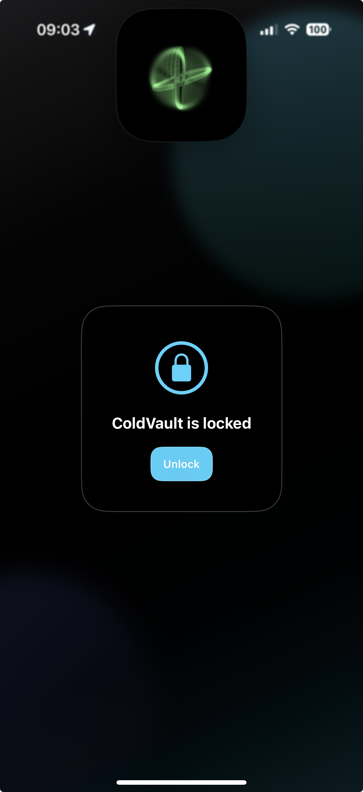
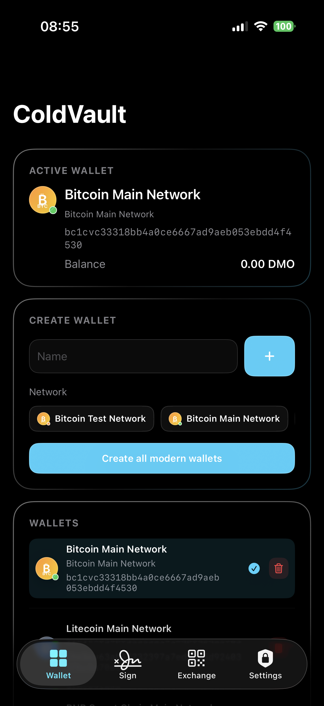
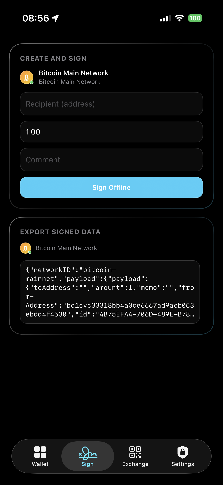
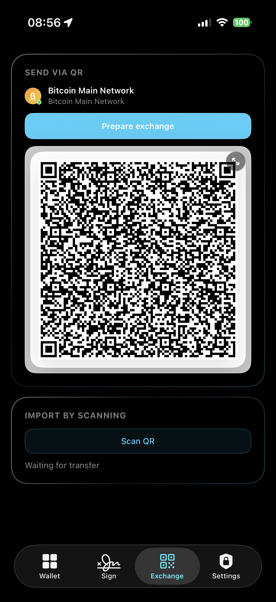
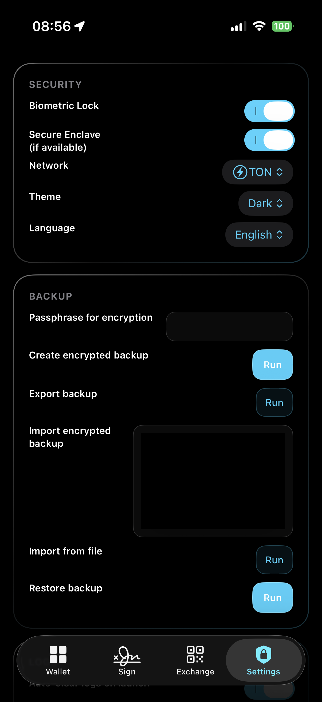

# ColdVault


ColdVault is an iOS-first offline-oriented crypto wallet companion focused on secure key handling, transaction signing, and QR-based air-gapped data transfer.

## Why this app exists

ColdVault helps people who want stronger operational security for crypto activity:

- Reduces online attack surface by supporting offline transaction workflows.
- Uses local secure storage and optional Secure Enclave support for private key material.
- Provides biometric app lock to protect access on-device.
- Enables offline payload exchange via QR instead of direct network APIs.
- Adds encrypted backup/restore so users can recover app state safely.

## What ColdVault can do

- Create and manage wallets for multiple blockchain networks.
- Sign transactions offline from locally stored keys.
- Export signed payloads for broadcast on another system.
- Prepare and import QR payloads for device-to-device transfer.
- Keep a local security event log with localization support.
- Protect app access with Face ID / Touch ID.
- Create encrypted backups and restore app state from backup.
- Switch app language and theme at runtime.

## Screenshots

<table>
   <tr>
      <td></td>
      <td></td>
      <td></td>
      <td></td>
      <td></td>
   </tr>
   <tr>
      <td align="center">Lock screen</td>
      <td align="center">Wallet dashboard</td>
      <td align="center">Sign flow</td>
      <td align="center">Exchange QR flow</td>
      <td align="center">Security and backup</td>
   </tr>
</table>

## Technical overview

- Language: Swift 5
- UI framework: SwiftUI
- Platform: iOS 16+
- Project generation: XcodeGen
- Architecture: MVVM

### Main layers

- App layer: app lifecycle, dependency wiring, root composition.
- View layer: SwiftUI screens and reusable UI components.
- ViewModel layer: state orchestration and feature workflows.
- Service layer: security, wallet logic, QR generation/decoding, backup encryption.
- Model layer: domain entities and persisted settings/events.

## Security model at a glance

- Private keys are generated and stored locally.
- Optional Secure Enclave path is used when available.
- Biometric authentication gates app access.
- QR payload flow supports offline exchange scenarios.
- Backups are encrypted before export and decrypted on restore.

Note: ColdVault is educational/prototype software and not financial advice. Always perform independent security review before production use.

## Supported devices

- iPhone (primary target)
- iOS 16.0 and newer
- Simulator is supported for development and UI testing (some security behavior is limited vs real devices)

## Project structure

- `ColdVault/App` - app entry and primary view model
- `ColdVault/Views` - SwiftUI screens and components
- `ColdVault/Services` - security, wallet, network adapter, QR, backup services
- `ColdVault/Models` - settings, wallet, events, network and transaction models
- `ColdVault/Resources` - assets, plist, localization files
- `project.yml` - XcodeGen project specification

## Getting started

### Prerequisites

- macOS with latest stable Xcode
- Xcode command line tools
- XcodeGen installed (`brew install xcodegen`)

### Setup

1. Clone the repository.
2. Open a terminal in the project root.
3. Generate Xcode project:
   - `xcodegen generate`
4. Open `ColdVault.xcodeproj` in Xcode.
5. Select `ColdVault` scheme.
6. Run on an iPhone simulator or physical device.

### Build from terminal

Use this command to validate compilation in CI/local automation:

```bash
xcodebuild -project ColdVault.xcodeproj -scheme ColdVault -destination 'generic/platform=iOS Simulator' build
```

## Localization

ColdVault currently includes:

- English (`en`)
- Russian (`ru`)

Language can be switched at runtime from app settings.

## Architecture notes

- `ColdVaultViewModel` is the central state hub.
- Services are injected into the view model for separation of concerns.
- Views remain lightweight and declarative, delegating business logic to view model/services.
- Event log entries are stored in normalized form for localization-aware rendering.

## Deployment notes

- iOS target is configured via `project.yml` and generated into Xcode project settings.
- Bundle identifier default: `com.coldvault.app`.
- App icon and localization resources are included in the repository.

## Privacy and repository hygiene

This repository is configured to avoid committing local build artifacts and machine-specific files. See `.gitignore`.

## Contributing

Contributions are welcome. Please read `CONTRIBUTING.md` before opening a pull request.

Issue and PR workflows are standardized with templates:

- Bug report template: `.github/ISSUE_TEMPLATE/bug_report.md`
- Feature request template: `.github/ISSUE_TEMPLATE/feature_request.md`
- Pull request template: `.github/pull_request_template.md`
- Issue template configuration: `.github/ISSUE_TEMPLATE/config.yml`
- Code owners: `.github/CODEOWNERS`
- Code of conduct: `CODE_OF_CONDUCT.md`
- Support guide: `SUPPORT.md`

## Security policy

For vulnerability reporting and coordinated disclosure guidance, see `SECURITY.md`.

## Roadmap ideas

- Unit/UI tests for critical security and localization flows.
- Optional export/import hardening and integrity metadata.
- Accessibility improvements and additional locales.
- Extended wallet/network adapters.

## License

This project is licensed under the MIT License. See `LICENSE`.
